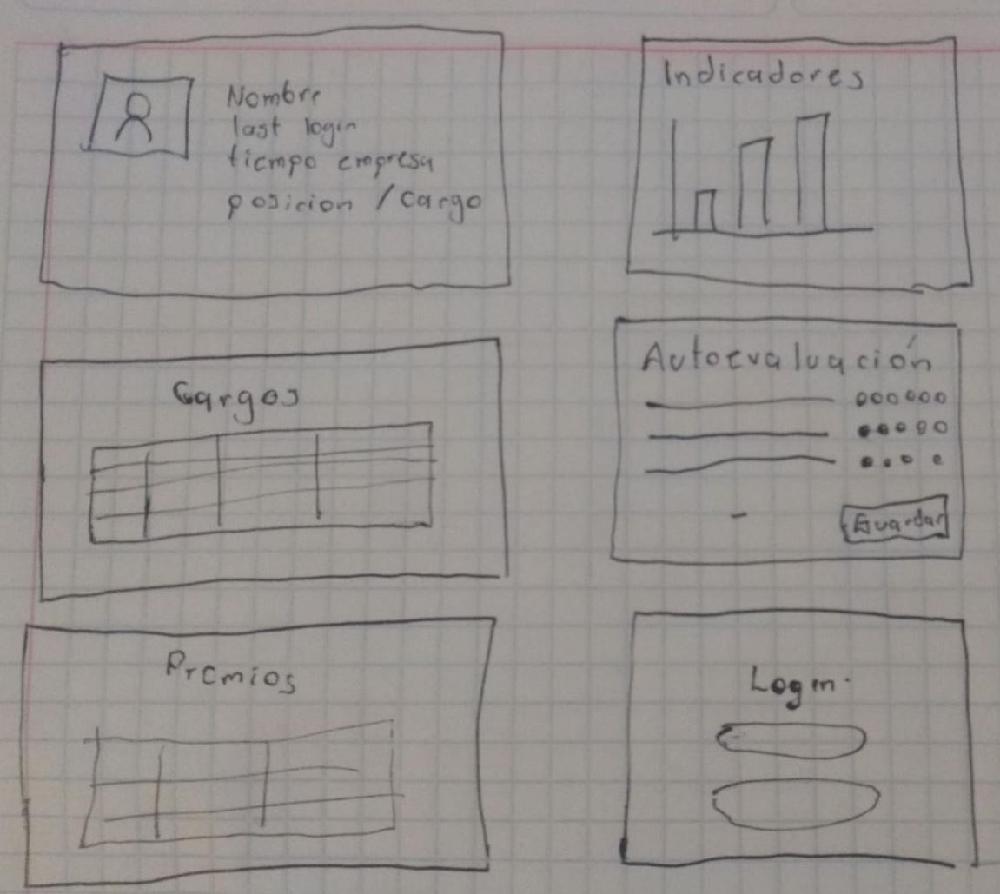
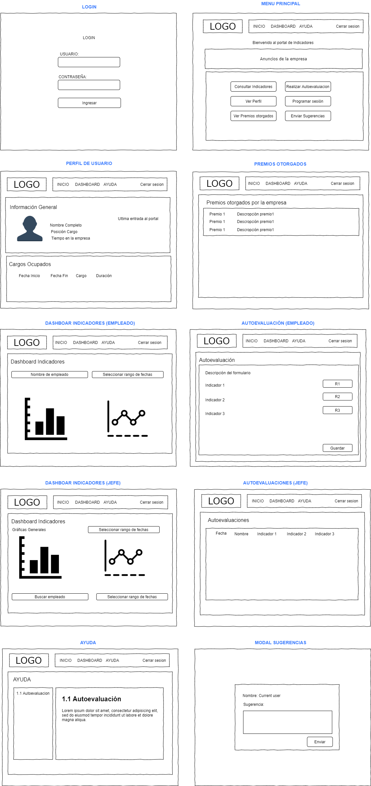
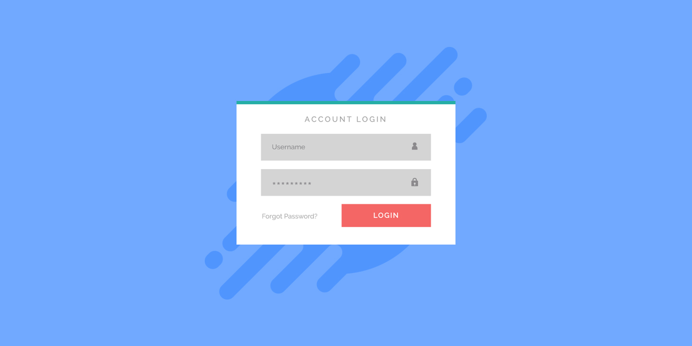
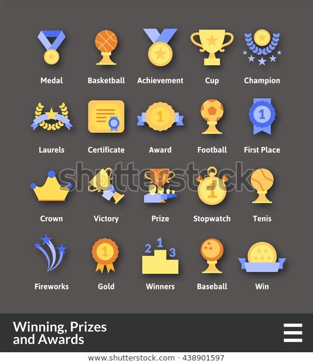
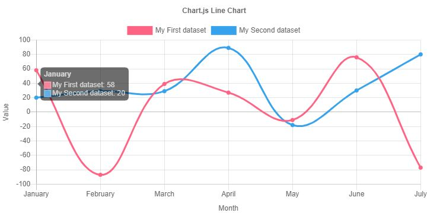
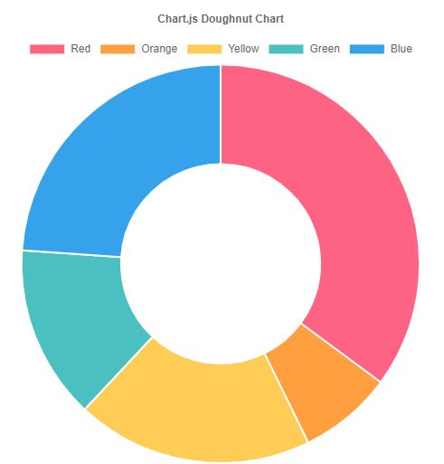
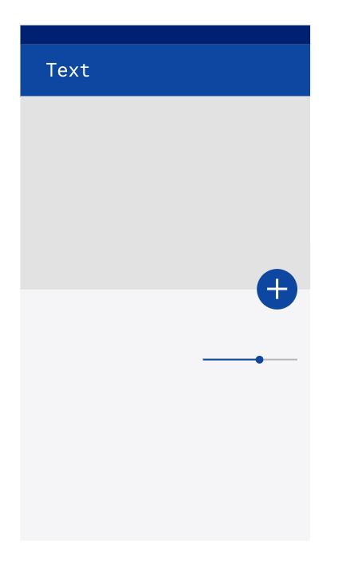

# Reto Prototipado

> curso de Diseño de Interfaces UI y UX y Prototipado
>

## Benchmarking
* [ HReader] (https://www.hrider.net/)

## User personas
#### Pedro
Acerca: 
Es un trabajador de nuevo ingreso, esta aprendiendo a utilizar las herramientas del trabajo, le gustan las cosas sencillas.

#### Ana
Acerca:
Jefe de un equipo de trabajo, busca conocer como ha sido el crecimiento de sus empleados, visualizar los datos de forma grafica, ademas, que sus empleados reciban un feedback correcto de sus indicadores en la empresa, 

#### Alex
Acerca:
Un empleado ejemplar que busca siempre mejorar sus puntos debiles, le gusta ser reconocido y monitorear su actividad

## User Journeys

**User Persona:** Pedro

**Ecenario:** Primera vez que ingrsa busca realizar su autoevaluación 

**Objetivo:** Realizar su evaluacion, conocer la aplicación.

**Acciones:** 
* Solicita un usuario
* Ingresa a la plataforma con su usario y contraseña
* Ingresa al menú principal
* Visualiza que tiene una ventana de ayuda en caso de ser necesario
* Selecciona Autoevaluación
* Lee las instrucciones del formulario
* Evalúa 
* Guarda

**User Persona:** Ana

**Escenario:** Necesita visualizar los avances del mes de sus empleados

**Objetivo:** Ver dashboard

**Acciones:**
* Ingresa a la plataforma con su usuario y contraseña
* Seleccionar Consultar indicadores
* Por su tipo de usuario le apareceran los indicadores de la empresa
* Utiliza la barra de busqueda y empieza a filtrar los nombres de los empleados
* Selecciona un rango de fechas
* Selecciona el botón consultar

**User Persona:** Alex

**Ecenario:** Quiere ver los premios que ha obtenido en la empresa desde que tiene su nuevo cargo, tiene algunas sugerencias de nuevos indicadores que podrian ayudar la visibilidad del trabajo

**Objetivo:** Escribir sugerencia

**Acciones:**
* Ingresa a la plataforma con su usuario y contraseña
* Ingresa al menú principal
* Selecciona
* Selecciona premios otorgados

## Wireframes 
(Bocetos rápidos en papel leyendo requerimientos)

## Wireframes digitales

## Moodboard

https://www.chartjs.org/

https://material.io/resources/color/#!/?view.left=0&view.right=0&primary.color=0D47A1

</>
Colores

`#0d47a1`

`#5472d3`

`#002171`

## Diseño de interfaces

